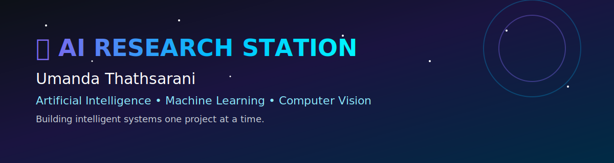
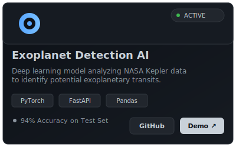
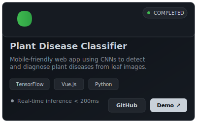
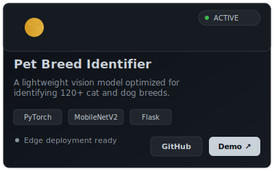
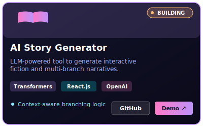

<!-- =============================================== -->
<!--             AI RESEARCH STATION                 -->
<!-- =============================================== -->

<!-- AI Boot Screen & Banner -->

 

 

 

<!-- Recruiter Quick View -->
<table>
  <tr>
    <td align="center" width="25%">
      🎯 <b>Focus</b> Artificial Intelligence & Machine Learning
    </td>
    <td align="center" width="25%">
      🎓 <b>Status</b> Undergraduate (BSc IT) Open to Internships
    </td>
    <td align="center" width="25%">
      📍 <b>Location</b> Sri Lanka (Remote Ready)
    </td>
    <td align="center" width="25%">
      🔗 <b>Connect</b> 
      <a href="https://linkedin.com/in/umandathathsarani">LinkedIn</a> • 
      <a href="mailto:umandathathsarani@gmail.com">Email</a>
    </td>
  </tr>
</table>

---

## 🌌 About Me

I am an aspiring **AI Engineer and ML Researcher** with a strong foundation in full-stack development. I am deeply passionate about pushing the boundaries of what machines can learn and how they can perceive the world around them. 

My career objective is to build highly scalable, intelligent systems that solve complex real-world problems. Whether it's training deep neural networks, deploying edge computer vision models, or building robust backend pipelines, I thrive on continuous learning and impactful engineering.

- 🤖 Specializing in **Machine Learning, Deep Learning, and Computer Vision**.
- ⚡ Experienced in building high-performance APIs with **FastAPI and Python**.
- 🌐 Proficient in bridging the gap between AI and user-facing applications.
- 🌱 Currently exploring advanced Generative AI and MLOps.

---

## 💻 AI Dashboard & Status

 

---

## 🛠 Skills Matrix

| Category | Technologies & Tools |
|---|---|
| **Programming Languages** |        |
| **AI & Machine Learning** |       |
| **Backend & APIs** |     |
| **Frontend Frameworks** |   |
| **Databases** |    |
| **DevOps & Cloud** |     |

---

## 🚀 Project Showcase

  

### 🌟 Featured Architecture

*In this section, I highlight the end-to-end architecture and model pipelines of my most complex AI projects.* 

### 📂 Active Projects

  <table>
    <tr>
      <td align="center">
         
        <b><a href="https://github.com/umandathathsarani/exoplanet-explorer">View GitHub Repo</a></b>
      </td>
      <td align="center">
         
        <b><a href="https://github.com/umandathathsarani/plant-disease-detection">View GitHub Repo</a></b>
      </td>
    </tr>
    <tr>
      <td align="center">
         
        <b><a href="https://github.com/umandathathsarani/cat-identifier-ai">View GitHub Repo</a></b>
      </td>
      <td align="center">
         
        <b><a href="https://github.com/umandathathsarani/interactive-fiction-engine">View GitHub Repo</a></b> &nbsp;•&nbsp; <b><a href="https://midnight-clocktower-binuumat.up.railway.app/">Live Demo ↗</a></b>
      </td>
    </tr>
  </table>

---

## 📈 GitHub Intelligence

  

  

### 🐍 Contribution Activity

 

 

---

## ⏳ Experience & Education Timeline

- **[Current] BSc in Information Technology** 
  - Specialization in Artificial Intelligence.
  - Participating in university AI research groups.
- **[2024] Freelance Full-Stack Developer**
  - Built internal tools and integrated ML models into web dashboards.
- **[2023] Open Source Contributor**
  - Contributed to various Python-based machine learning libraries.

---

