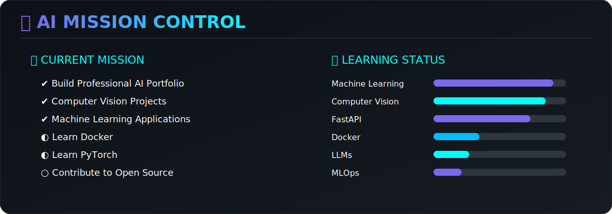

<!-- =============================================== -->
<!--             AI RESEARCH STATION                 -->
<!-- =============================================== -->

<div align="center">


<br><br>


<br>


</div>

---

# 🤖 AI Research Station

```text
Name          : Umanda Thathsarani

Role          : AI Engineer

Location      : Sri Lanka

Education     : BSc Information Technology

Specialization: Artificial Intelligence

Status        : Building Intelligent Systems
````

---

# 🌌 About Me

I'm an undergraduate specializing in **Artificial Intelligence** with a passion for creating intelligent software that solves real-world problems.

My interests include:

* 🤖 Machine Learning
* 👁 Computer Vision
* 🧠 Deep Learning
* ⚡ FastAPI
* 🌐 Full Stack Development
* ☁ Cloud Deployment

---

<p align="center">


</p>

---

# 💻 Technology Stack

<div align="center">


</div>

---

## 🚀 Featured Projects

<div align="center">

<table>

<tr>

<td>

</td>

<td>

</td>

</tr>

<tr>

<td>

</td>

<td>

</td>

</tr>

</table>

</div>

---

# 📊 GitHub Analytics

<div align="center">


</div>

---

<div align="center">


</div>

---

<div align="center">


</div>

---

# 🏆 Achievements

<div align="center">


</div>

---

---

# 🐍 Contribution Snake

<div align="center">


</div>

---

# 🚀 Mission Control

<div align="center">



</div>

---

# 🌍 Connect With Me

<p align="center">

<a href="https://linkedin.com/in/YOUR_LINK">

</a>

<a href="mailto:YOUR_EMAIL">

</a>

</p>

---

<div align="center">


</div>
```

